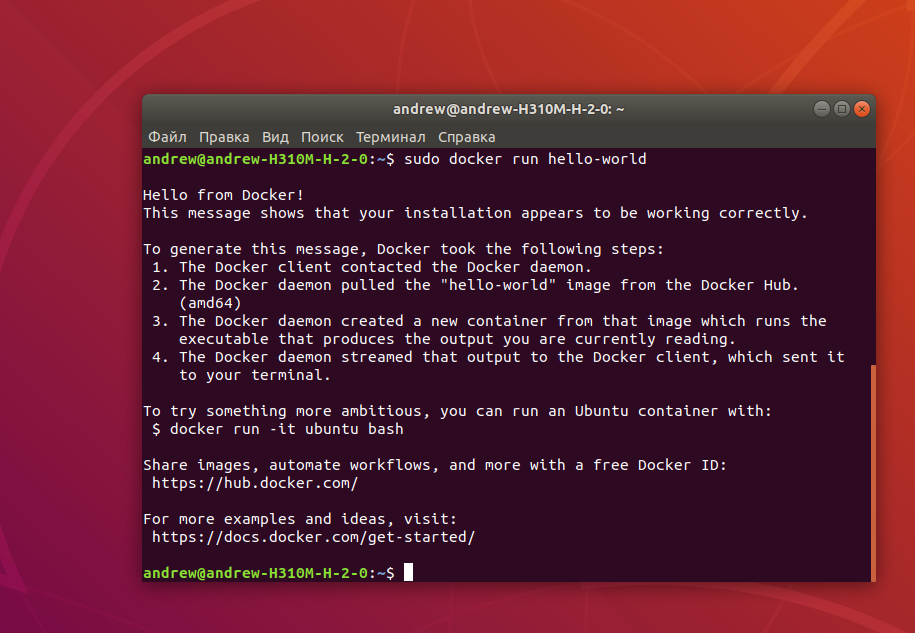
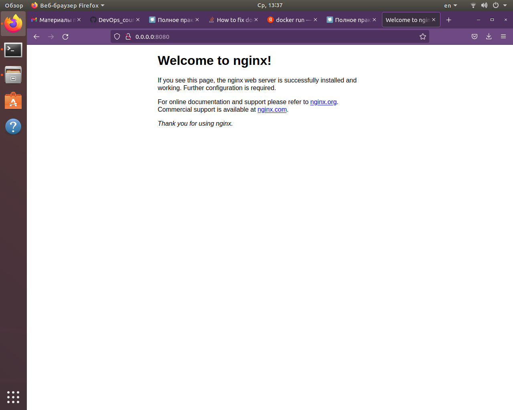
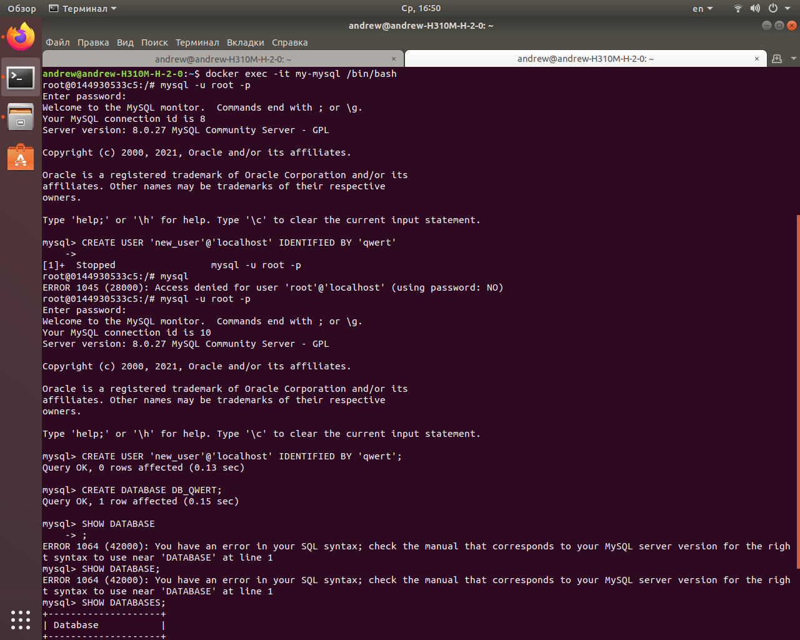
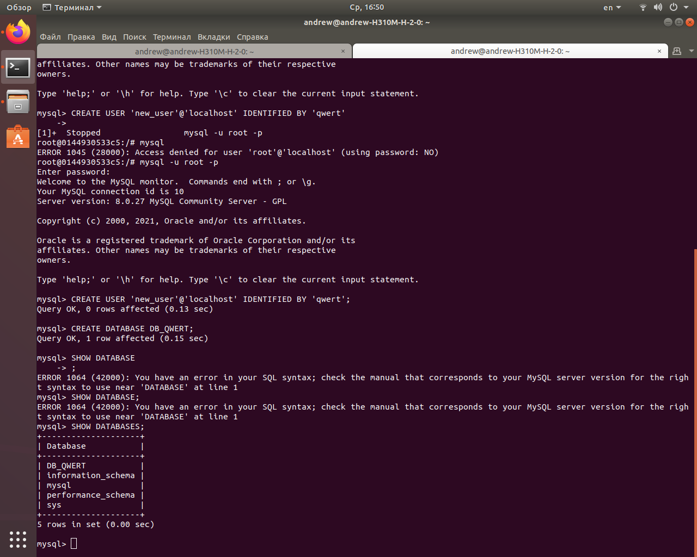
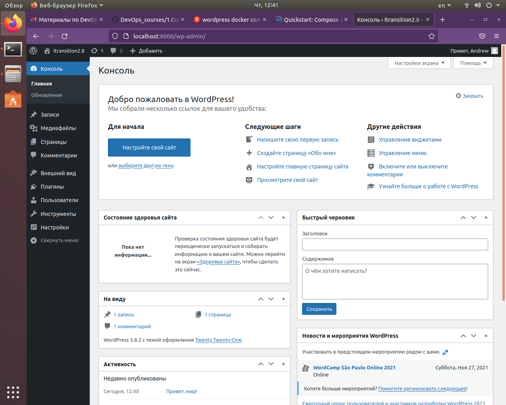

# Работа с Docker
### 2.6.2 Устанавливаем Docker на машину и выполняем проверку


### 2.6.3 Скачаем контейнер с nginx и запустим с парметром -p
```
docker pull nginx
docker run --name (my-nginx) -p 8080:80 nginx
```




### 2.6.4 Запустим контейнер с MySQL используя -v
```
docker pull mysql
docker run --name my-mysql -v /my/own/datadir: /var/lib/mysql -e MYSQL_ROOT_PASSWORD=(qwert) mysql
```


### 2.6.5 Подключимся к базе, создадим нового пользователя и базу
```
Запустим командную строку в контейнере:

docker exec -it mysql /bin/bash


>mysql -u root -p
>CREATE USER ''@'localhost' IDENTIFIED BY ''
>CREATE DATABASE ''
```


 
# Работа с Dockerfile

### Создать образ с Ubuntu 20.04 и Ruby 2.7.2


# Работа с Docker-compose


